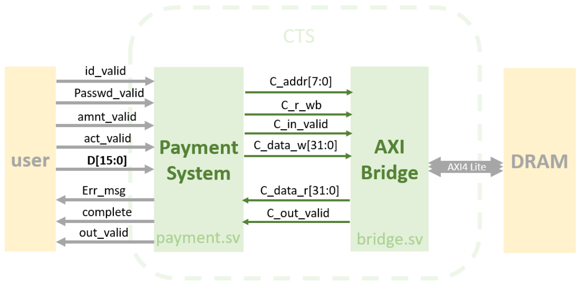
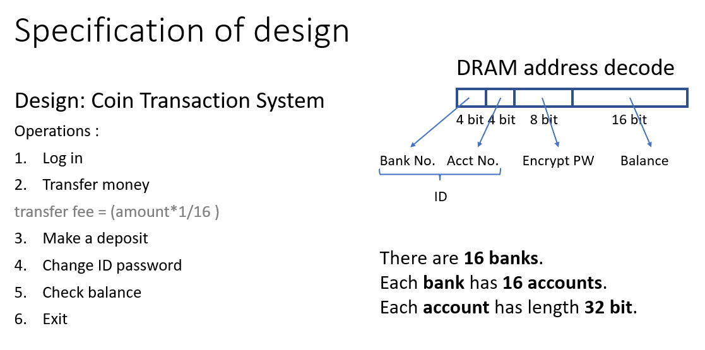
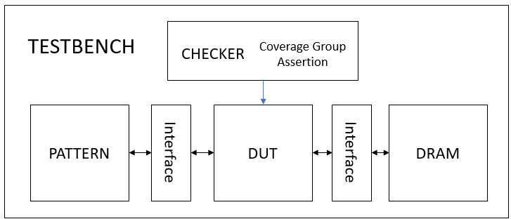
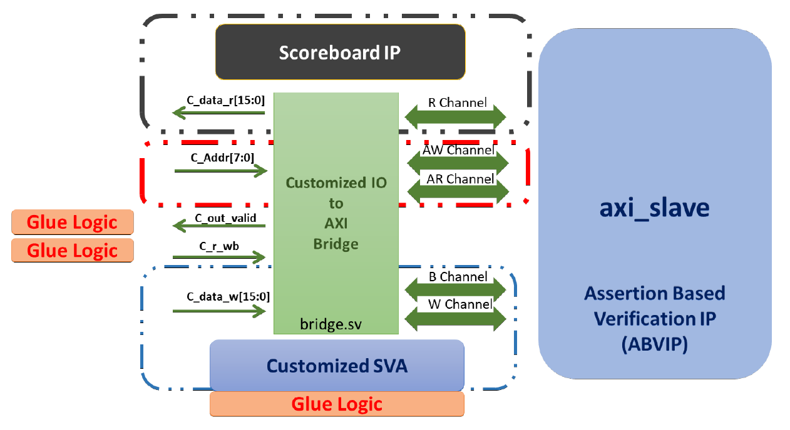

# SystemVerilog_Coursework
These are some coursework related to SystemVerilog Design &amp; Verification in a graduate-level course, Integrated_Circuit_Design_Laboratory_IC_Lab, at NCTU.

## Table of Content
  * [Project 09 Design using SystemVerilog](#project-09-design-using-systemverilog)
  * [Project 10 Verification using System Verilog Coverage and Assertion](#project-10-verification-using-system-verilog-coverage-and-assertion)
    + [Functional Coverage](#functional-coverage)
    + [Type of System Verilog Assertion](#type-of-system-verilog-assertion)
  * [Project 10_5 SystemVerilog Formal Verification](#project-10-5-systemverilog-formal-verification)

## Project 09 Design using SystemVerilog
- built a Coin Transaction System based on **AXI Lite**. This system allows users to transfer money, make a deposit, change their ID password, or simply check their account balance.
- defined SystemVerilog **interface, data type, enumerate** in SystemVerilog **Package**.

Graph 1: block diagram of Coin Transfer System (CTS)

Graph 2: DRAM address decode

## Project 10 Verification using System Verilog Coverage and Assertion
- In the checker module, written **covergroups** and **assertions** using System Verilog.
- Developed the verification pattern for the CTS (from Lab09) and achieved coverage goals.
- Developed direct testing pattern to **minimize the simulation time**.

### Functional Coverage
1. Use auto_bin_max to create coverpoint : 
    - ID : 256 bins, each bin hit at least 1 time.
    - Error No. : 5 bins, each bin hit at least 10 times.
    - Complete : 2 bins, each bin hit at least 100 times.
2. User-defined state bin:
    - Passwd  : divided into 4 bins, each bin hit 10 times.
    - Balance : divided into 5 bins, each bin hit at least 20 times.
3. Transition bin :
    - Action : 24 transition bins, each bin hit at least 10 times.
4. Cross bin :
    - Combination of complete & balance bins: each combination occurs at least 20 times.

### Type of System Verilog Assertion
1. SVA
    + All outputs should be zero after reset. 
    + If action is completed, inf.err_msg must be 4’b0.
2. SVA + Glue Logic
    + When action is trnsf, id_valid should come earlier than amnt_valid. The gap length between id_valid and amnt_valid is at least 1 cycle. 
3. SVA + Nondeterministic Constants
    + Assume AXI in_valid will not occur during bridge transmit data. 
4. ABVIP + Glue Logic (In Project 10_5)
    + Use glue logic to define test mode, which is used to control ABVIP outgoing port.

## Project 10_5 SystemVerilog Formal Verification
- used ABVIP to verify the offered Customized I/O to AXI4-Lite bridge. The main focus of this exercise is to check the protocol and find some bugs inside the bridge with a build-in scoreboard and customized SVA by Formal Verification tool - JasperGold.

